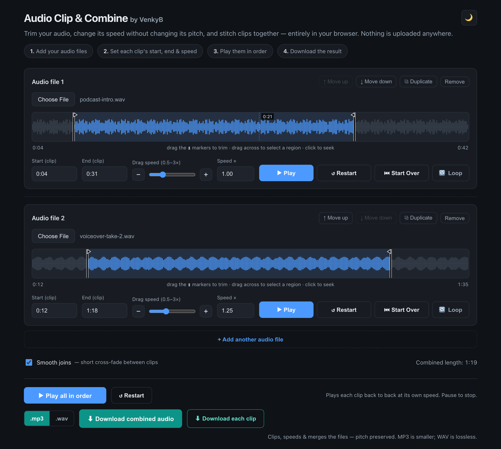

# 🎵 Audio Clip & Combine

Cut, speed up, and join audio clips together — all inside your web browser.
No sign-up, no install, and your files never leave your computer.

### ▶ Try it: **https://balaji4aws.github.io/audio-tools/**



## What you can do

1. **Add** one or more audio files from your computer.
2. **Trim** each one — type a start and end time, or drag the markers on the waveform.
3. **Change the speed** (0.5×–3×). Voices still sound natural — no chipmunk effect.
4. **Play** the clips back to back to hear how they fit together.
5. **Download** the result as one merged file, or as one file per clip (MP3 or WAV).

It also works on a phone, has a dark/light theme and keyboard shortcuts, and remembers
your clip settings when you come back to the page.

> **Tip:** times are `MM:SS`, and a lone number means *minutes*. Type `0:10` for ten seconds.

## How it works

The whole app is a single `index.html` — about 2,500 lines of plain HTML, CSS, and
JavaScript. No React, no build step, no `npm install`. Open the file and it runs.

A few parts that took more work than they look like they would:

- **Nothing is uploaded.** Audio is decoded and processed in the browser with the Web Audio
  API. That means no server to run, nothing to pay for, and no privacy question to answer.
- **Changing speed without changing pitch.** Browsers can do this for live playback
  (`preservesPitch`), but they offer nothing for the file you export. So the export
  implements **WSOLA** (Waveform-Similarity Overlap-Add) by hand on the raw samples: for
  each chunk of sound it searches for the spot where that chunk best lines up with what
  came before, then blends them. Skipping that alignment step is what makes naive
  speed-changed audio sound warbly.
- **MP3 encoding in the browser**, using [lamejs](https://github.com/zhuker/lamejs) in
  chunks so the progress bar keeps moving instead of the tab locking up.
- **The waveform** is drawn on a `<canvas>` and redrawn every animation frame while a clip
  plays, to move the playhead.
- **One set of drag handlers** covers mouse, touch, and pen, via pointer events.

## Run it locally

```bash
git clone https://github.com/balaji4aws/audio-tools.git
cd audio-tools
python3 -m http.server 8000
```

Then open http://localhost:8000.

## Also in this repo

Three small shell scripts for the workflow around the app:

| Script | What it does | Needs |
| --- | --- | --- |
| `download.sh` | Download audio from a YouTube video or playlist | [`yt-dlp`](https://github.com/yt-dlp/yt-dlp) |
| `audio_edit.sh` | The same trim / speed / join, from the terminal | [`ffmpeg`](https://ffmpeg.org/) |
| `deploy.sh` | Publish the app to AWS S3 + CloudFront | AWS CLI |

```bash
./download.sh "https://youtu.be/VIDEO_ID"
./audio_edit.sh songA.mp3 0:00 0:45 1.5 songB.mp3 1:00 1:20 0.75 combined.mp3
```

Run `./audio_edit.sh --help` for the full argument list. (Note: in the CLI a lone number
means *seconds*, not minutes.)

## Built with

Vanilla JavaScript · Web Audio API · Canvas · [lamejs](https://github.com/zhuker/lamejs)
(MP3 encoder, LGPL) · Bash · [ffmpeg](https://ffmpeg.org/) ·
[yt-dlp](https://github.com/yt-dlp/yt-dlp) · AWS S3 + CloudFront · GitHub Pages

Built by **Balaji Venkatesh** — [LinkedIn](https://www.linkedin.com/in/venkyb27) — with
[Kiro](https://kiro.dev).

## License

No license file yet, which under default copyright law means all rights to the original
code are reserved. (`lame.min.js` keeps its own LGPL license from upstream.) Add an
[OSI-approved license](https://choosealicense.com/) if you'd like to allow reuse.
